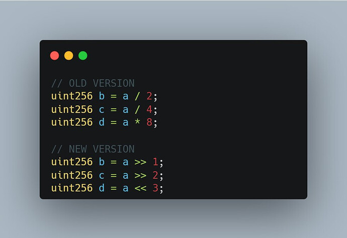
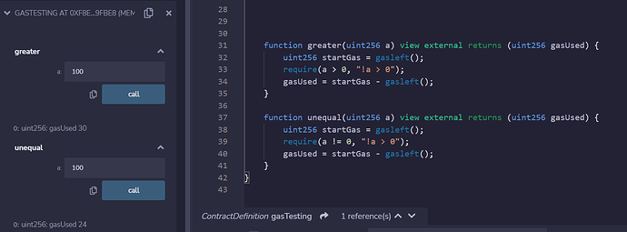

## Gas Optimization Techniques

1. **Storage Variables**
   - Storage operations are expensive (20,000 gas for saving, 5,000 gas for updating)
   - Always cache storage variables in memory within functions
   - Pack multiple storage variables into single slots when possible
   - Free unused storage slots to get 15,000 gas refund
   - Make variables constant whenever possible

2. **Data Types and Packing**
   - Use bytes32 instead of string/bytes when possible
   - Use smaller uint types only when packing with other variables
   - Variable packing only works in storage, not in memory/calldata
   - Pack inherited contract variables efficiently

3. **Memory vs Storage**
   - Avoid copying arrays from storage to memory
   - Use storage pointers instead of memory for large arrays
   - Memory costs increase quadratically with size

4. **Function Visibility**
   - Use external instead of public when possible
   - External functions use calldata instead of memory for parameters
   - Place frequently called functions earlier in contract
   - Make functions payable if they don't handle Ether
   
5. **Function Execution**
   - Reduce number of function parameters
   - Use modifiers carefully as they increase code size
   - Short-circuit operations (place cheaper checks first)
   - Use unchecked blocks for math that can't overflow

6. **Error Handling**
   - Use custom errors instead of strings
   - Keep require/revert messages short
   - Use assert only for invariant checking

7. **Use shift right/left instead of division/multiplication if possible**
    - While the DIV / MUL opcode uses 5 gas, the SHR / SHL opcode only uses 3 gas. Furthermore, beware that Solidity's division operation also includes a division-by-0 prevention which is bypassed using shifting. Eventually, overflow checks are never performed for shift operations as they are done for arithmetic operations. Instead, the result is always truncated.

    


8. **Use != 0 instead of > 0 for unsigned integer comparison**
    - When dealing with unsigned integer types, comparisons with != 0 are cheaper then with > 0

    

9. **Caching the length in for loops**
    ```solidity
        uint length = arr.length;
        for (uint i = 0; i < length; i++) {
            // do something that doesn't change arr.length
        }
    ```
    - In the above example, the sload or mload or calldataload operation is only called once and subsequently replaced by a cheap dupN instruction. Even though mload , calldataload and dupN have the same gas cost, mload and calldataload needs an additional dupN to put the offset in the stack, i.e., an extra 3 gas.
    - This optimization is especially important if it is a storage array or if it is a lengthy for loop.

10. **State variables that can be set to immutable**
    - Solidity 0.6.5 introduced immutable as a major feature. It allows setting contract-level variables at construction time which gets stored in code rather than storage.
    - Consider you have a variable "owner" at contract level which is set during construction time. This variable is not immutable so each call to the function owner() reads from storage, using a sload . After EIP-2929, this costs 2100 gas cold or 100 gas warm. We can make this cheaper by making the variable immutable, now each storage read of the owner state variable is replaced by the instruction push32 value , where value is set during contract construction time. This costs only 3 gas.

11. **Consider having short revert strings**

12. **Consider using custom errors instead of revert strings**

13. **The increment in for loop postcondition can be made unchecked**
    - Consider the following loop:
    ```solidity
        for (uint i = 0; i < arr.length; i++) {
            // do something that doesn't change arr.length
        }
    ```
    - The increment in the postcondition can be made unchecked to save 3 gas per iteration.
    ```solidity
        for (uint256 i = 0; i < length; ) {
            // do something that doesn't change the value of i
            unchecked {
                i++;
            }
        }
    ```
    - Note that it’s important that the call to unchecked_inc is inlined. This is only possible for solidity versions starting from 0.8.2.

14. **Payable constructor**
    - You can cut out 10 opcodes in the creation-time EVM bytecode if you declare a constructor payable. The following opcodes are cut out:
        - CALLVALUE
        - DUP1
        - ISZERO
        - PUSH2
        - JUMPI
        - PUSH1
        - DUP1
        - REVERT
        - JUMPDEST
        - POP
    - This saves around 200 gas for deployment.
